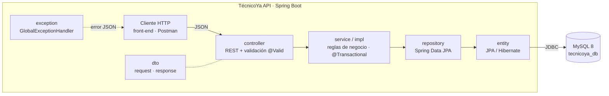
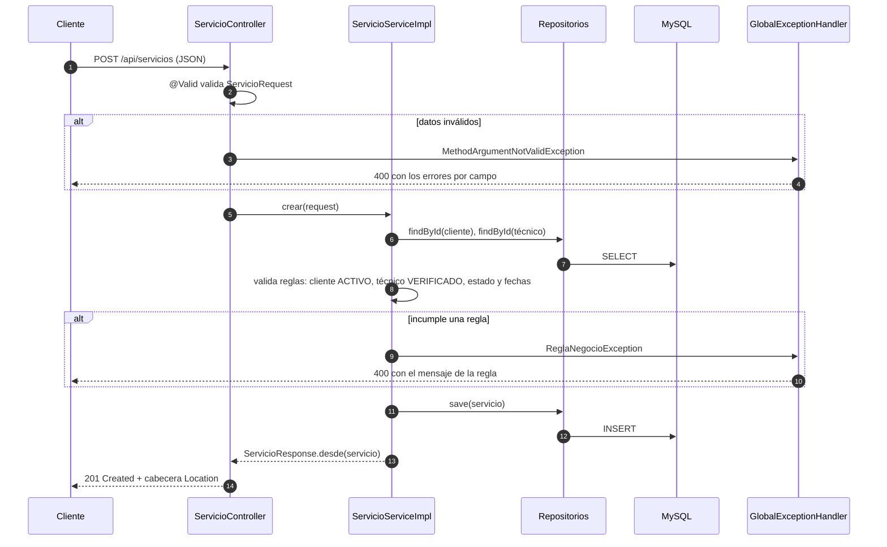
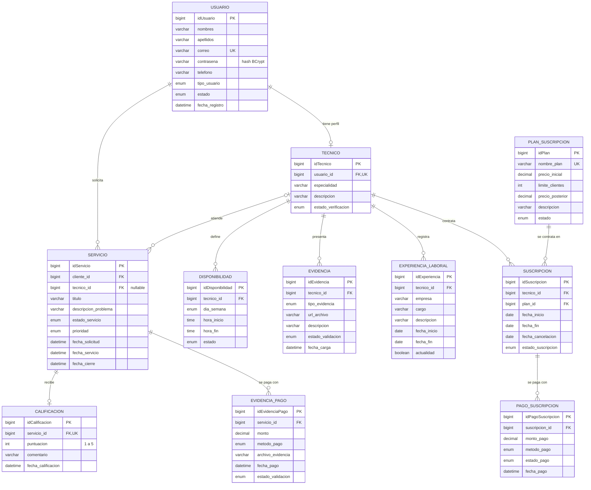

# Descripción del sistema

Documento técnico de la API de **TécnicoYa**: qué hace, cómo está construida, qué módulos la componen y de qué depende.
Para los endpoints en detalle, ver [api-rest.md](api-rest.md). Para las clases y métodos, abrir el Javadoc en [apidocs/index.html](apidocs/index.html).

## 1. Propósito y alcance

TécnicoYa conecta a **clientes** que necesitan un servicio a domicilio (electricidad, plomería, refrigeración, soporte de cómputo, etc.) con **técnicos** verificados que lo realizan. Esta API REST es el *back-end* de la plataforma: guarda la información y aplica las reglas de negocio. Cualquier *front-end* web o móvil la consume por HTTP con JSON.

| Actor | Cómo participa en el sistema |
|---|---|
| Cliente | Usuario `CLIENTE`. Solicita servicios, los califica y registra el pago. |
| Técnico | Usuario `TECNICO` con un perfil de técnico. Publica su disponibilidad, evidencias y experiencia; atiende servicios y se suscribe a un plan. |
| Administrador | Usuario `ADMINISTRADOR`. Verifica técnicos y valida evidencias y pagos cambiando sus estados. |
| Proveedor de pago | Sistema externo. No se integra directamente: el resultado de cada cobro se registra en los estados de `evidencia_pago` y `pago_suscripcion`. |

Funcionalidad disponible:

- CRUD completo de los 11 recursos del modelo de datos (5 operaciones cada uno).
- Inicio de sesión con correo y contraseña (`POST /api/auth/login`).
- Validación de datos de entrada y de reglas de negocio, con errores en JSON y en español.

## 2. Arquitectura

La aplicación es un monolito **Spring Boot 4** con arquitectura **en capas**. Cada capa solo conoce a la de abajo, y los DTOs aíslan el formato JSON del modelo de base de datos.

| Capa | Responsabilidad | No debe |
|---|---|---|
| `controller` | Recibir la petición HTTP, validar el DTO de entrada y devolver el código HTTP correcto | Contener lógica de negocio ni acceder a repositorios |
| `service` / `service.impl` | Aplicar las reglas de negocio dentro de una transacción y mapear entidades a DTOs | Conocer detalles de HTTP |
| `repository` | Consultar y guardar entidades | Contener reglas de negocio |
| `entity` | Representar las tablas de la base de datos | Salir de la capa de servicio (nunca se devuelven al cliente) |
| `exception` | Traducir cualquier excepción a un JSON de error uniforme | — |

### Flujo de una petición

Ejemplo: un cliente solicita un servicio con `POST /api/servicios`.

## 3. Módulos

Código fuente en `src/main/java/com/tecnicoya/api`:

| Paquete | Contenido | Clases principales |
|---|---|---|
| *(raíz)* | Arranque de la aplicación | `TecnicoYaApiApplication` |
| `config` | Configuración transversal | `CorsConfig` (CORS abierto para desarrollo), `PasswordConfig` (BCrypt) |
| `controller` | 12 controladores REST | Uno por recurso (`UsuarioController`, `ServicioController`…) y `AuthController` |
| `dto.request` | 12 *records* de entrada con Bean Validation | `UsuarioRequest`, `ServicioRequest`, `LoginRequest`… |
| `dto.response` | 12 *records* de salida, cada uno con su método `desde(entidad)` | `UsuarioResponse`, `ServicioResponse`, `ApiErrorResponse`… |
| `entity` | 11 entidades JPA, una por tabla | `Usuario`, `Tecnico`, `Servicio`… |
| `entity.enums` | 12 enums con los valores de tipos y estados | `TipoUsuario`, `EstadoServicio`, `MetodoPago`… |
| `exception` | Excepciones de negocio y manejador global | `RecursoNoEncontradoException`, `ReglaNegocioException`, `ConflictoException`, `CredencialesInvalidasException`, `GlobalExceptionHandler` |
| `repository` | 11 interfaces Spring Data JPA | `UsuarioRepository`, `DisponibilidadRepository` (con consulta de cruces de horario)… |
| `service` | Contratos y reglas documentadas | `CrudService<Q, R>` y una interfaz por recurso |
| `service.impl` | 11 implementaciones transaccionales | `ServicioServiceImpl`, `SuscripcionServiceImpl`… |
| `util` | Utilidades | `FechaUtil` |

Otros directorios del repositorio:

| Ruta | Contenido |
|---|---|
| `src/main/resources/application.properties` | Configuración de la aplicación |
| `src/test/java` | Pruebas unitarias de los servicios |
| `database/` | `schema.sql` (DDL de las 11 tablas) y `data.sql` (datos de ejemplo) |
| `postman/` | Colección de Postman con pruebas de todos los endpoints |
| `docs/` | Esta documentación y el Javadoc generado (`apidocs/`) |

## 4. Modelo de datos

Base de datos MySQL `tecnicoya_db` (`utf8mb4`, motor InnoDB). El esquema lo crea `database/schema.sql`. Hibernate **no** genera tablas; solo valida al arrancar que las entidades coinciden con ellas (`ddl-auto=validate`).

### Qué pasa al eliminar

| Relación (hijo → padre) | Al borrar el padre | Motivo |
|---|---|---|
| `tecnico` → `usuario` | Se borra en cascada | El perfil pertenece al usuario |
| `disponibilidad`, `evidencia`, `experiencia_laboral` → `tecnico` | Se borran en cascada | Son datos propios del técnico |
| `calificacion` → `servicio` | Se borra en cascada | La calificación no existe sin su servicio |
| `servicio` → `usuario` (cliente) y → `tecnico` | Se impide el borrado | Historial de servicios |
| `evidencia_pago` → `servicio` | Se impide el borrado | Registro financiero |
| `suscripcion` → `tecnico` y → `plan_suscripcion` | Se impide el borrado | Registro financiero |
| `pago_suscripcion` → `suscripcion` | Se impide el borrado | Registro financiero |

Si el borrado se impide, la API responde `409` con un mensaje en español. Para retirar a un usuario con historial, se recomienda cambiar su `estado` a `INACTIVO` en vez de borrarlo.

Además de las claves foráneas, el esquema define restricciones `CHECK`: fechas coherentes, `hora_fin > hora_inicio`, puntuación de 1 a 5, montos mayores que 0, y que una experiencia sin fecha de fin esté marcada como actual. Son una segunda barrera: la API valida lo mismo antes y responde con un mensaje claro.

## 5. Reglas de negocio

Las reglas se aplican en la capa de servicio y cada interfaz las documenta en su Javadoc. Resumen:

| Recurso | Reglas principales |
|---|---|
| Usuario | Correo único, normalizado a minúsculas. Contraseña obligatoria al crear y guardada con BCrypt. Un usuario con perfil de técnico no puede cambiar de tipo. |
| Inicio de sesión | Mismo mensaje para correo inexistente y contraseña incorrecta. Solo entran cuentas `ACTIVO`. |
| Técnico | El usuario debe ser `TECNICO` y tener un solo perfil. Estado de verificación inicial `PENDIENTE`. |
| Servicio | El cliente debe ser `CLIENTE` y estar `ACTIVO`. Solo se asignan técnicos `VERIFICADO`. `ASIGNADO`, `EN_PROCESO` y `FINALIZADO` exigen técnico. La fecha de cierre solo existe en `FINALIZADO` o `CANCELADO`. |
| Disponibilidad | `horaFin > horaInicio` y sin cruces con otras franjas del mismo técnico el mismo día. |
| Evidencia | URL `http(s)`. Estado inicial `PENDIENTE`. |
| Experiencia laboral | Trabajo actual ⇔ sin fecha de fin. Fechas no futuras y en orden. |
| Calificación | Solo servicios `FINALIZADO`, una por servicio, puntuación de 1 a 5. |
| Evidencia de pago | Servicio no `CANCELADO` y con técnico. Monto mayor que 0. |
| Plan de suscripción | Nombre único sin distinguir mayúsculas. Precios ≥ 0 y límite ≥ 1. |
| Suscripción | Plan `ACTIVO`, `fechaFin > fechaInicio` y una sola suscripción `ACTIVA` por técnico. |
| Pago de suscripción | No se registran pagos de suscripciones `CANCELADA`. |

## 6. Dependencias

Las versiones las gestiona el *parent* `spring-boot-starter-parent` 4.1.1, salvo que se indique otra cosa.

| Dependencia | Versión | Para qué se usa |
|---|---|---|
| `spring-boot-starter-webmvc` | 4.1.1 | API REST: Spring MVC 7.0.9, Tomcat 11.0.24 embebido y Jackson 3.1.5 para JSON |
| `spring-boot-starter-data-jpa` | 4.1.1 | Persistencia: Spring Data JPA, Hibernate ORM 7.4.5 y pool de conexiones HikariCP 7.0.2 |
| `spring-boot-starter-validation` | 4.1.1 | Validación de DTOs con Bean Validation (Hibernate Validator 9.1.3) |
| `spring-security-crypto` | 7.1.1 | Solo el cifrado BCrypt de contraseñas; no activa Spring Security |
| `mysql-connector-j` | 9.7.0 | Driver JDBC de MySQL (solo en ejecución) |
| `lombok` | 1.18.46 | Genera *getters*, *setters*, constructores y el *logger* (solo en compilación) |
| `spring-boot-starter-test` | 4.1.1 | Pruebas: JUnit 6.0.3, Mockito 5.23.0 y AssertJ 3.27.7 |

Plugins de Maven:

| Plugin | Uso |
|---|---|
| `maven-compiler-plugin` | Compila con Java 17 y ejecuta el procesador de anotaciones de Lombok |
| `spring-boot-maven-plugin` | `spring-boot:run` y el JAR ejecutable |
| `maven-javadoc-plugin` 3.12.0 | Genera el Javadoc en `docs/apidocs` |

Entorno necesario: **JDK 17** o superior y **MySQL 8.0.16** o superior. Maven no hace falta instalarlo: el *wrapper* (`mvnw` / `mvnw.cmd`) descarga Maven 3.9.16.

## 7. Configuración

Archivo `src/main/resources/application.properties`. Las credenciales se leen de variables de entorno o del archivo local `.env` (ignorado por git; plantilla en `.env.example`):

| Variable | Valor por defecto | Descripción |
|---|---|---|
| `DB_URL` | `jdbc:mysql://localhost:3306/tecnicoya_db?...` | URL JDBC de la base de datos |
| `DB_USER` | `root` | Usuario de MySQL |
| `DB_PASSWORD` | `root` | Contraseña de MySQL |
| `SERVER_PORT` | `8080` | Puerto HTTP de la API |

Otros ajustes relevantes:

| Propiedad | Valor | Motivo |
|---|---|---|
| `spring.jpa.hibernate.ddl-auto` | `validate` | El esquema lo crea el script SQL; Hibernate solo comprueba que coincide |
| `spring.jpa.hibernate.naming.physical-strategy` | `PhysicalNamingStrategyStandardImpl` | Respeta los nombres de columna tal cual (`idUsuario`, `tipo_usuario`) |
| `spring.jpa.open-in-view` | `false` | Las consultas terminan en la capa de servicio, no durante la respuesta HTTP |
| `spring.sql.init.mode` | `never` | Los scripts SQL se ejecutan manualmente |

## 8. Decisiones de diseño

- **DTOs como `record`.** Las entidades nunca salen de la capa de servicio, así que el JSON no cambia si cambia la base de datos y la contraseña nunca se expone.
- **Validación en tres niveles.** Bean Validation en los DTOs (formato), reglas en los servicios (negocio) y restricciones `CHECK`/FK en MySQL (última barrera).
- **Errores uniformes.** Todas las respuestas de error tienen la misma forma (`ApiErrorResponse`), con mensaje en español y detalle por campo cuando aplica.
- **Contraseñas con BCrypt.** Se guarda el hash, nunca el texto plano.
- **Enums nativos de MySQL.** Tipos y estados son columnas `ENUM` y *enums* de Java, así que un valor no permitido se rechaza con la lista de opciones válidas.
- **Consultas eficientes.** Los listados usan `@EntityGraph` para traer las relaciones en una sola consulta y evitar el problema N+1.
- **Fechas sin fracciones de segundo** (`FechaUtil.ahora()`), para que lo que devuelve la API coincida con lo guardado en las columnas `DATETIME`.

## 9. Limitaciones conocidas

- **Sin tokens de sesión.** `POST /api/auth/login` valida las credenciales, pero no emite un token (JWT o sesión) y el resto de endpoints no exigen autenticación. El siguiente paso natural es incorporar Spring Security con JWT y permisos por rol.
- **CORS abierto** a cualquier origen: pensado solo para desarrollo local.
- **Listados sin paginación ni filtros.** Cada `GET` de colección devuelve todos los registros.
- **Proveedor de pago no integrado.** Los estados de los pagos se actualizan manualmente mediante la API.

## 10. Pruebas

| Tipo | Dónde | Cómo se ejecuta |
|---|---|---|
| Unitarias (JUnit + Mockito, sin base de datos) | `src/test/java/.../service/impl` | `./mvnw test` |
| Integración de la API completa (106 peticiones con validaciones) | `postman/TecnicoYa-API.postman_collection.json` | *Collection Runner* de Postman, o `npx newman run postman/TecnicoYa-API.postman_collection.json` |

La colección de Postman borra todo lo que crea, así que puede ejecutarse varias veces sobre los datos de ejemplo.
